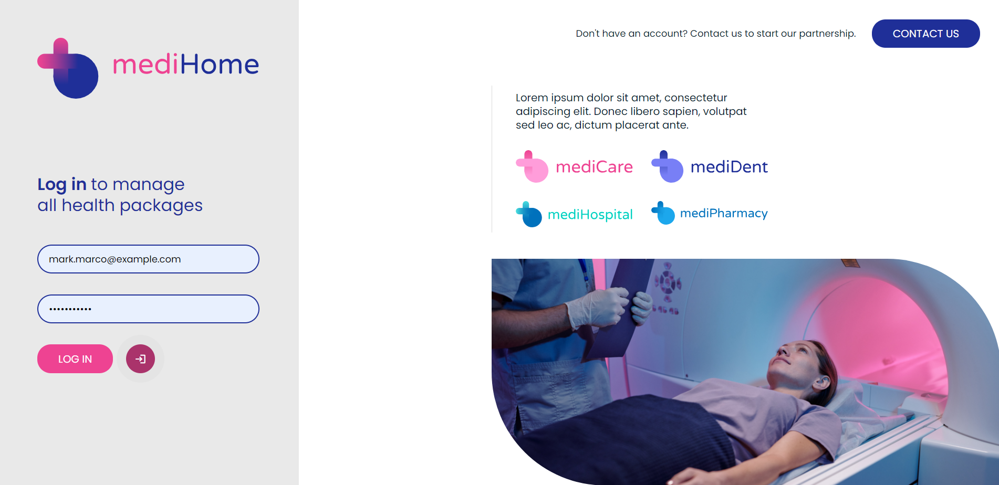

# mediHome-App


mediHome is a clinic desktop app that allows users to book medical appointments. It was build using React, Firebase, Sass and Vite. You can find a demo [here](https://medihome111.netlify.app/#/portal). Please hover over the icon next the LOG IN button to get email and password of demo user. Project also includes animated landing page, where I explored a lot of animation libraries, you can preview it [here](https://medihome111.netlify.app/).
<br/>

<br/>

## It contains various features:

- users can log in,
- see their appoinments and check details (if the appointment has been completed, it's possible to check the recommendations that doctor left for the patient),
- search, book and cancell appointments,
- update their password and personal information.

_All server data is hosted using Firebase’s Firestore. For the moment only patient dashboard is available - mock ups for admin and doctor dashboards have been designed but haven't been implemented yet. At the moment it's only possible to manage appointments and users through the code (Firestore API) or Firebase user dashboard directly._
<br/>

**Current state:**

- [x] Patient dashboard first iteration
- [x] Polishing patient dashboard, refactoring and optimizing code
- [x] Landing page designed na built
- [x] RWD
- [ ] Admin dashboard
- [ ] Doctor dashboard

<br/>
## Design

Below you can find mock ups for 3 different dashboards: patient, doctor and admin. At the moment only patient dashboard is available and fully functional.

Link to [Patient Dashboard Design](https://xd.adobe.com/view/c4e766c5-ed9d-4288-bb68-28f81215e99a-91b4/)

Link to [Doctor Dashboard Design](https://xd.adobe.com/view/89d1a1ea-2062-480c-a126-6c6f6e8d0709-dc82/)

Link to [Admin Dashboard Design](https://xd.adobe.com/view/0bba04bf-2fe9-4e81-bcbf-cbb93090a705-5ee9/)

Link to [Landing Page Design](https://xd.adobe.com/view/091cb395-7e90-49fd-9c82-9f20a87f103c-5c4f/)

## How to run this application on your own

To run the application on your own, you need to follow couple of steps. All steps are mandatory for the application to work:

1. Clone the repository

2. Set up your own **Firestore database** in Firebase (don't fill it with any collections/documents yet, we will autogenerate in later steps).

3. Create your own **.env file** based on .env.example file that you can find in this repository. Keep this file locally to avoid sharing access keys to your database! .gitignore already ignores .env files.

4. It's time to **npm install** the project in the terminal:

```
npm install
```

Once it's done use below command to start dev run:

```
npm run dev
```

5. _[This step requires the most attention and it's not as smooth as it could be, sorry about that.]_ In app.jsx you will find executions of 2 functions (within useEffect body), that needs to be uncommented: createDatabase() and fillAvailableAppos(). Once you do, please refresh project preview in your browser **(just once)** and let functions do the work.

   You can open the browser to console to check flying console.logs. This is a sign that appointments are being generated in your database. If console goes silent it means all appointments were created. You can comment functions back (to avoid creating database again).

   > [!WARNING]
   > Don't refresh the preview when above functions are working. They create whole database structure and insert all predefined appointments to the server (console logs inform about creating new appointments).

   > [!WARNING]
   > If any error appears or you interrupted the database creation, shut down the development preview, delete all collections in your database (directly on your Firestore account). Example user also needs to be deleted (authentication tab on your Firebase console). Once this is done, you can run functions again.

   > [!NOTE]
   > If you want to customize appointments that will be generated, you can go to **fillAvalailableAppos.js** and learn how the **fillWithSingleAppoSet** function works. It creates sets of similar appointments on the server (@params described on top of function declaration). The function is then used multiple times in function **fillAvailableAppos** that's declared below in the same file, you can customize function exectuions there.

   > [!NOTE]
   > For the moment database creates appointments for 2023 only, if it's 2024 already and there are no fresh appointments, feel free to adjust **fillAvailableAppos.js** and **createDatabase.js** accordingly.

6. Project uses React HashRouter, you need to add **/#/portal** to localhost link in the browser (e.g. _http://localhost:5173/#/portal/_). When you go to this adress you should see login screen. Above functions have created example user in your database. Default login is: "mat.marco@example.com", password is: "321medi".

7. When you log in you can see main dashboard, you can now check appointments that this user currrently has (there were also autogenerated on the server). Have a little fun and book one more appointment for this patient, enjoy!

<br/>


